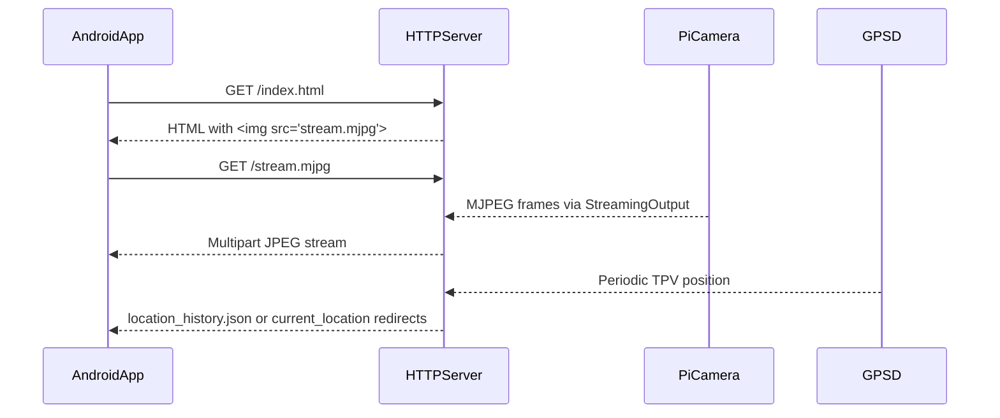
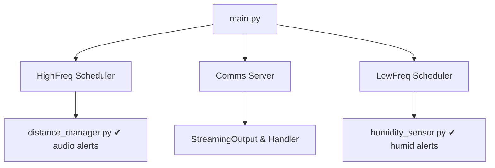

**Student Name:** Usmonov Mahmudkhon  
**Student ID:** 23013088  
**Course:** IoT (**Internet of Things**)
**Professor:** MUHAMMAD ZUBAIR ISLAM
**Group:** G


# Android Client
This section describes the Android application that acts as a client for the Raspberry Pi streaming and sensing server. It focuses on tests, configuration, and how the app integrates with the backend services.

## Testing
These tests verify that the Android project is correctly configured and that basic logic behaves as expected. They are useful when refactoring or upgrading dependencies.

### ExampleUnitTest.java
This local unit test verifies basic logic on the host JVM. It asserts that arithmetic operations work as expected. It does not require an emulator or device.

Additional details:
- The class uses JUnit 4 and the `@Test` annotation to define test methods.
- It runs in the JVM, so it cannot access Android framework classes.
- You can extend it with more pure Java tests, for example utility methods or parsers.

Example usage:

```java
// Example of adding another simple unit test
@Test
public void max_isCorrect() {
    assertEquals(5, Math.max(3, 5));
}
```

### ExampleInstrumentedTest.java
This instrumentation test runs on an Android device or emulator. It validates the application context and package name, ensuring the manifest is configured correctly.

More details:
- It uses `AndroidJUnit4` as the test runner, which integrates with the Android testing framework.
- `InstrumentationRegistry.getInstrumentation().getTargetContext()` gives the app under test context.
- The assertion `assertEquals("com.example.picamera", appContext.getPackageName())` guards against misconfigured `applicationId`.

Example extension:

```java
// Example: check that a resource string is available
@Test
public void appName_isSmartShoe() {
    Context appContext = InstrumentationRegistry.getInstrumentation().getTargetContext();
    String appName = appContext.getString(R.string.app_name);
    assertEquals("Smart Shoe", appName);
}
```

## App Module Configuration
This configuration defines how the Android module builds, which permissions it needs, and how it integrates with libraries. It also sets up the main activity and theme.

### AndroidManifest.xml
Defines the application namespace, required permissions (INTERNET, RECORD_AUDIO, FOREGROUND_SERVICE, ACCESS_NETWORK_STATE, storage), backup and security rules, and declares `MainActivity` as the launcher in landscape mode.

Key points:
- Permissions:
  - `INTERNET` and `ACCESS_NETWORK_STATE`: allow HTTP access to the Raspberry Pi server and connection monitoring.
  - `RECORD_AUDIO` and `FOREGROUND_SERVICE`: allow continuous audio capture and long running services.
  - `READ_EXTERNAL_STORAGE` and `WRITE_EXTERNAL_STORAGE`: allow screen recording files in the Movies directory.
- `android:networkSecurityConfig="@xml/network_security_config"` and `android:usesCleartextTraffic="true"` allow HTTP, not HTTPS, which is needed for local Pi streaming.
- The application theme is set to `@style/Theme.PiCamera`, which controls colors and status bar appearance.

Snippet:

```xml
<activity
    android:name=".MainActivity"
    android:exported="true"
    android:screenOrientation="landscape">
    <intent-filter>
        <action android:name="android.intent.action.MAIN" />
        <category android:name="android.intent.category.LAUNCHER" />
    </intent-filter>
</activity>
```

This ensures the app always opens in landscape, which matches the camera stream orientation.

### build.gradle (Module: app)
Configures compile SDK 32, minimum SDK 26, target SDK 32, and versioning. It declares dependencies on HBRecorder, AndroidX libraries, Material Components, and testing frameworks.

Additional details:
- `applicationId "com.example.picamera"` must match the package in the manifest and tests.
- HBRecorder provides high level screen recording functionality, which the app uses for recording MJPEG playback.
- ConstraintLayout and Material Components provide modern UI widgets and layouts.

Key fragment:

```groovy
dependencies {
    implementation 'com.github.HBiSoft:HBRecorder:2.0.5'
    implementation 'androidx.appcompat:appcompat:1.5.0'
    implementation 'com.google.android.material:material:1.6.1'
    implementation 'androidx.constraintlayout:constraintlayout:2.1.4'
}
```

You can add further dependencies, for example analytics, but must keep SDK versions consistent.

### proguard-rules.pro
Holds project-specific ProGuard rules. By default, it’s empty but can preserve JS interfaces or debugging info when minification is enabled.

Important considerations:
- When enabling `minifyEnabled true` in `build.gradle`, ProGuard and R8 will start shrinking and obfuscating.
- If you use WebView JavaScript interfaces, you must keep those classes to avoid runtime crashes.
- You can also keep HBRecorder classes if obfuscation causes issues.

Example rule:

```pro
# Keep HBRecorder public API classes if needed
-keep class com.hbisoft.hbrecorder.** { *; }
```

## Gradle Wrapper
This part ensures that anyone who clones the project uses the same Gradle version. It increases reproducibility in CI and across developers.

### gradle-wrapper.properties
Specifies Gradle 7.3.3 distribution for reproducible builds.

Details:
- `distributionUrl` points to a binary distribution, not all sources, which speeds downloads.
- Files are stored under `~/.gradle/wrapper/dists` by default.
- This version matches the Android Gradle Plugin 7.2.2 compatibility matrix.

### gradlew
Shell script that invokes the Gradle Wrapper, handling Windows paths on Cygwin and quoting arguments.

More notes:
- You should run `./gradlew assembleDebug` instead of calling `gradle` directly.
- The script sets JVM options and passes them to the wrapper main class.
- It handles path translation on Cygwin and MSYS to support different environments.

### settings.gradle
Defines the root project name (“Pi Camera”) and includes the `:app` module.

Usage notes:
- Additional modules, such as shared libraries, can be added with `include ':lib'`.
- `dependencyResolutionManagement` configures central repositories including JitPack, useful for HBRecorder.
- `pluginManagement` ensures the correct plugin repositories for the build.

### gradle.properties
Global Gradle JVM and AndroidX settings, such as `-Xmx2048m` and non-transitive R-classes.

Key flags:
- `org.gradle.jvmargs=-Xmx2048m -Dfile.encoding=UTF-8` prevents out-of-memory errors for large builds.
- `android.useAndroidX=true` enables AndroidX package names.
- `android.nonTransitiveRClass=true` keeps R classes smaller, which can marginally improve build times.

### build.gradle (Root)
Applies Android plugin versions 7.2.2; defines a `clean` task to delete the build directory.

Further explanation:
- `plugins` block declares Android application and library plugin versions, applied by subprojects.
- The `clean` task is a convenience to remove all compiled output.
- You can add common configuration for all modules here if needed.

# UI Resources
These resources define the user interface layout and icons for the Android client. They are consumed mainly by `MainActivity`.

## Layouts
Layouts describe the structure and positioning of views on screen. They connect to Java code through `findViewById` in `MainActivity`.

### activity_main.xml
Main UI uses a `ConstraintLayout` to position:
- A `WebView` for MJPEG video.
- Image buttons for settings, recording, connection, and location.
- A `ProgressBar` for connection status.
- A `TextView` to show recording time.

Additional behavior:
- `MainActivity` sets click listeners on `settingsImageView`, `recordImageView`, `connectImageView`, and `locationImageView`.
- The `WebView` loads URLs pointing to the Raspberry Pi server, such as `http://<pi-ip>:8000/index.html`.
- `connectionProgressBar` visibility is controlled in the custom `WebViewClient` to show page loading progress.

Snippet:

```xml
<WebView
    android:id="@+id/webView"
    android:layout_width="0dp"
    android:layout_height="0dp"
    app:layout_constraintTop_toBottomOf="@id/topButtons"
    app:layout_constraintBottom_toBottomOf="parent"
    app:layout_constraintStart_toStartOf="parent"
    app:layout_constraintEnd_toEndOf="parent" />
```

### dialog_connection.xml
Horizontal `LinearLayout` with:
- An `EditText` to input server IP.
- A “Connect” button styled by `bg_button.xml`.

More context:
- `MainActivity` inflates this layout into an `AlertDialog` when the user taps the connect icon.
- The entered IP address is stored in `SharedPreferences` under the app key.
- After confirmation, the app loads the Pi URL into the `WebView` and may start the audio thread.

Pseudo-code snippet:

```java
View view = getLayoutInflater().inflate(R.layout.dialog_connection, null);
EditText ipEdit = view.findViewById(R.id.ipEditText);
// When user taps "Connect", save IP and load URL in WebView
```

### dialog_settings.xml
Horizontal `LinearLayout` with:
- A `TextView` label “Automatic Saving”.
- A `Spinner` for auto‐save intervals (Off, 1, 3, 5 minutes).

Detailed behavior:
- `MainActivity` reads and writes the selected interval into `SharedPreferences` with key `"AutoSave"`.
- The spinner item positions are mapped to minute values using `time[0] = 2 * position - 1`.
- HBRecorder uses this value to decide when to stop recording automatically.

Example mapping:
- Off → `-1` means no automatic stop.
- "1 minute" → `1`, "3 minutes" → `3`, "5 minutes" → `5`.

## Drawables
Drawables provide backgrounds and icons for the user interface. Most are vector drawables for scalability.

### bg_button.xml
Shape drawable defining a white rectangle with rounded corners (20 dp), used for dialog buttons.

Further details:
- It uses `<shape android:shape="rectangle">` with `<corners android:radius="20dp" />`.
- The `solid` color references `@color/white`, keeping theming consistent.
- This drawable improves touch target visibility on custom dialogs.

### Vector Icons  
| File                  | Purpose                      |
|-----------------------|------------------------------|
| ic_connect.xml        | Connect action               |
| ic_disconnect.xml     | Disconnect action            |
| ic_launcher_background.xml | Adaptive icon background |
| ic_launcher_foreground.xml | Adaptive icon foreground |
| ic_location.xml       | Location available indicator |
| ic_no_location.xml    | Location unavailable         |
| ic_record.xml         | Recording status             |
| ic_settings.xml       | Settings gear                |
| ic_stop.xml           | Stop action (red)            |
| ic_videos.xml         | Video library icon           |

Additional notes:
- `ic_connect` and `ic_disconnect` are toggled based on connection state `isConnected` in `MainActivity`.
- `ic_location` and `ic_no_location` are toggled based on whether GPS redirection is active.
- `ic_record` and `ic_stop` represent recording state and are swapped when HBRecorder starts or stops.

Example usage in layout:

```xml
<ImageView
    android:id="@+id/recordImageView"
    android:layout_width="wrap_content"
    android:layout_height="wrap_content"
    android:background="@drawable/ic_record" />
```

## Mipmaps
Mipmaps hold launcher icons in various pixel densities. They ensure sharp icons on all devices.

### ic_launcher.xml
Adaptive launcher icon combining `@color/ic_launcher_background` and `@drawable/ic_launcher_foreground`.

Details:
- Adaptive icons support different shapes on OEM launchers.
- Background and foreground layers can animate slightly when focused.
- `ic_launcher` is referenced in the manifest `android:icon` and `android:roundIcon`.

### ic_launcher_round.xml
Round variant of the adaptive icon.

Notes:
- Used by some launchers that prefer circular icons.
- References the same background and foreground resources.

## Values
Value resources centralize colors, strings, and themes for the application. They help maintain consistency.

### colors.xml
Defines the app palette: purple, teal, black, white.

More information:
- `purple_500` is the primary brand color used by the theme.
- `teal_200` and `teal_700` are secondary colors for accents.
- `black` and `white` support icons, text, and backgrounds.

### ic_launcher_background.xml
Specifies white for the launcher icon background.

Relationship:
- Used only by launcher icons and not by general UI.
- Helps ensure icons look clean on various wallpaper colors.

### strings.xml
Declares `app_name` as “Smart Shoe”.

Notes:
- The app name appears on the launcher and in the recent apps screen.
- You can add new strings here and reference them from layouts and Java code.

### themes.xml
Day theme extending MaterialComponents NoActionBar, setting primary and secondary colors.

Key aspects:
- The theme removes the default action bar so the app can use full screen.
- `colorPrimary`, `colorPrimaryVariant`, and `colorOnPrimary` control toolbar and status bar colors.
- You can override styles for buttons, text, and dialogs in this theme.

### themes.xml (Night)
Night variant with altered primary, secondary, and status bar colors.

Behavior:
- When the device uses dark mode, this theme is applied automatically.
- It changes background and foreground colors to reduce eye strain.
- Use this file to tweak contrast for dark environments.

## XML Configuration Rules
These XML files control backup, migration, and security behavior. They are referenced from the manifest.

### backup_rules.xml
Empty `<full-backup-content>` stub for Auto Backup (API 31+).

Important points:
- You can include or exclude specific shared preferences or files here.
- Needed only on Android 12+; older versions ignore this file.
- It is referenced in the manifest as `android:fullBackupContent`.

### data_extraction_rules.xml
Empty `<data-extraction-rules>` stub to control cloud and device-transfer backups.

Usage:
- Customize what data gets backed up to the cloud or transferred to another device.
- You can add `<include>` and `<exclude>` tags for fine control.
- Helps protect sensitive data from unintended backups.

### network_security_config.xml
Permits cleartext HTTP traffic for debugging and local streaming.

Details:
- `<base-config cleartextTrafficPermitted="true">` allows HTTP instead of HTTPS.
- It trusts system certificates by default through `<certificates src="system" />`.
- This configuration is essential because the Pi server usually exposes plain HTTP on port 8000.

# Python Backend
The Python backend runs on a Raspberry Pi and provides streaming, sensing, and alerting services. The Android client connects to it over the local network.

## comms/server.py
Implements a multi-threaded HTTP server for:
- `/index.html`: MJPEG video page embedding `stream.mjpg`.
- `/stream.mjpg`: continuous camera frames via `StreamingOutput`.
- `/location_history.json`: JSON array of saved GPS locations.
- `/current_location`: immediate redirect to Google Maps for the latest GPS point.

It also spawns a UDP audio server streaming PCM to port 8765 and polls GPS via `gpsd`.

Additional technical details:
- `StreamingOutput` wraps a `BytesIO` buffer and a `Condition` to notify waiting clients when a new JPEG frame arrives.
- `StreamingServer` extends `socketserver.ThreadingMixIn` and `HTTPServer`, allowing multiple clients to connect simultaneously.
- `get_audio()` uses `pyaudio` to play audio received over UDP, matching the packets sent by Android’s `AudioRecord`.
- GPS polling uses `gps(mode=WATCH_ENABLE | WATCH_NEWSTYLE)` and stores historical positions in the `location_history` list.

High level flow:



### HTTP API Endpoints

```api
{
  "title": "Root Redirect",
  "description": "Redirects root path to the main HTML page.",
  "method": "GET",
  "baseUrl": "http://<pi-ip-address>:8000",
  "endpoint": "/",
  "headers": [],
  "queryParams": [],
  "pathParams": [],
  "bodyType": "none",
  "requestBody": "",
  "formData": [],
  "responses": {
    "301": {
      "description": "Permanent redirect to /index.html",
      "body": ""
    },
    "404": {
      "description": "Not Found if handler fails unexpectedly",
      "body": ""
    }
  }
}
```

```api
{
  "title": "MJPEG HTML Page",
  "description": "Returns an HTML page embedding the MJPEG video stream.",
  "method": "GET",
  "baseUrl": "http://<pi-ip-address>:8000",
  "endpoint": "/index.html",
  "headers": [],
  "queryParams": [],
  "pathParams": [],
  "bodyType": "none",
  "requestBody": "",
  "formData": [],
  "responses": {
    "200": {
      "description": "HTML page with an image tag pointing to stream.mjpg",
      "body": "<html page that shows the MJPEG stream>"
    },
    "404": {
      "description": "Not Found if route not recognized",
      "body": ""
    }
  }
}
```

```api
{
  "title": "Location History",
  "description": "Returns an array of recorded GPS points in JSON format.",
  "method": "GET",
  "baseUrl": "http://<pi-ip-address>:8000",
  "endpoint": "/location_history.json",
  "headers": [
    {
      "key": "Accept",
      "value": "application/json",
      "required": false"
    }
  ],
  "queryParams": [],
  "pathParams": [],
  "bodyType": "none",
  "requestBody": "",
  "formData": [],
  "responses": {
    "200": {
      "description": "Array of latitude and longitude points",
      "body": "[{\"lat\": 37.7749, \"lng\": -122.4194}]"
    }
  }
}
```

```api
{
  "title": "Current Location Redirect",
  "description": "Redirects to a Google Maps URL for the latest GPS point.",
  "method": "GET",
  "baseUrl": "http://<pi-ip-address>:8000",
  "endpoint": "/current_location",
  "headers": [],
  "queryParams": [],
  "pathParams": [],
  "bodyType": "none",
  "requestBody": "",
  "formData": [],
  "responses": {
    "200": {
      "description": "HTML page with meta refresh redirecting to Google Maps",
      "body": "<html redirecting to Google Maps for last GPS point>"
    },
    "404": {
      "description": "Not Found if no GPS history exists",
      "body": ""
    }
  }
}
```

```api
{
  "title": "MJPEG Stream",
  "description": "Streams live MJPEG frames from the Pi camera.",
  "method": "GET",
  "baseUrl": "http://<pi-ip-address>:8000",
  "endpoint": "/stream.mjpg",
  "headers": [
    {
      "key": "Accept",
      "value": "multipart/x-mixed-replace",
      "required": false
    }
  ],
  "queryParams": [],
  "pathParams": [],
  "bodyType": "none",
  "requestBody": "",
  "formData": [],
  "responses": {
    "200": {
      "description": "Multipart MJPEG stream with boundary FRAME",
      "body": "--FRAME\\r\\nContent-Type: image/jpeg\\r\\nContent-Length: <len>..."
    }
  }
}
```

These endpoints are consumed by the Android `WebView` for video and by a browser for debugging purposes.

## config/alert.json
Array of `{ "threshold", "frequency", "duration" }` entries driving audio alerts in `distance_manager.py`.

Details:
- Each object represents a distance bin in centimeters and its corresponding beep behavior.
- `threshold` is the maximum distance for that mode, measured from the shoe.
- `frequency` is the tone frequency in Hertz, usually 440 for all bands here.
- `duration` is the beep length in seconds; closer obstacles use shorter, more frequent beeps.

Example:

```json
[
  { "threshold": 10, "frequency": 440, "duration": 0.25 },
  { "threshold": 20, "frequency": 440, "duration": 0.20 }
]
```

# High Frequency Processing
High frequency processing handles rapid events like distance measurement and obstacle alerts. It must react quickly to keep the user safe.

## distance_manager.py
Uses `gpiozero.DistanceSensor` on GPIO 23/24 to measure distance up to 2 m.  
- Samples every 0.5 s to update `alert_mode`.  
- Plays corresponding audio buffer at 1 s intervals.

More technical details:
- `TRIG_PIN` and `ECHO_PIN` are wired to the ultrasonic sensor on the Raspberry Pi GPIO header.
- `DIST_M_MAX = 2` and `TO_CM_SCALING = 100` convert sensor distance from meters to centimeters.
- On startup, the code loads `config/alert.json` into `update_conditions` and generates audio wave buffers using `numpy`.
- `simpleaudio.play_buffer` uses `ALERT_SAMPLING_RATE` to play these waveforms without blocking the scheduler too long.

Conceptual snippet:

```python
with open("config/alert.json") as f:
    update_conditions = json.load(f)
for conf in update_conditions:
    wave = generate_sine(conf["frequency"], conf["duration"])
    audio_waves.append(wave)
```

`update_alert_mode` examines the current distance and sets `alert_mode` to the index of the first threshold that the reading crosses. When no object is detected (`distance_sensor.value == 1`), it sets `alert_mode` to `None` to stop beeping.

## scheduler.py (high_freq)
Bootstraps a `sched.scheduler` to repeatedly invoke distance checks and user alerts.

Details:
- It creates a `sched.scheduler` object with `time.time` and `time.sleep`.
- It registers `update_alert_mode` and `alert_user` with different priorities and intervals.
- `scheduler.run()` blocks and processes events until the program ends.

This scheduler is created in a separate process from `main.py` to avoid blocking the communication server.

# Low Frequency Processing
Low frequency tasks handle slower environmental measurements, like humidity checks. They can tolerate longer sampling intervals.

## humidity_sensor.py
Reads DHT sensor humidity and temperature.  
- Prints readings and triggers entry/exit audio cues based on hysteresis thresholds.

More Explanation:
- It uses `Adafruit_DHT.read_retry(DHT_SENSOR, DATA_PIN)` to obtain humidity and temperature values.
- `HUMIDITY_THRESHOLD` and `HYSTERESIS` define when to trigger "entering wet environment" and "exiting wet environment" sounds.
- Two `simpleaudio` `WaveObject`s, `entering_audio` and `exiting_audio`, play wav files from `low_freq/audio_files`.

Pseudo-code snippet:

```python
if alert_state == 0 and humidity > HUMIDITY_THRESHOLD + HYSTERESIS:
    entering_audio.play()
    alert_state = 1
elif alert_state == 1 and humidity < HUMIDITY_THRESHOLD - HYSTERESIS:
    exiting_audio.play()
    alert_state = 0
```

## scheduler.py (low_freq)
Sets up and runs low-frequency humidity tasks using Python’s `sched`.

Details:
- Creates a `sched.scheduler` and registers `get_humidity_and_temprature` at a fixed period.
- Prints "Low frequency tasks setup done" once tasks are scheduled.
- `scheduler.run()` blocks and keeps executing the humidity check indefinitely.

This scheduler runs in the main process in `main.py`, while high frequency and comms tasks run in separate processes.

# Orchestration
Orchestration connects all components into a working IoT system. It controls processes for high frequency, low frequency, and communication tasks.

## main.py
Entry point that:
1. Launches high-frequency scheduler in a separate `Process`.
2. Launches the communication server in another `Process`.
3. Runs the low-frequency scheduler in the main process.



Further explanation:
- `from multiprocessing import Process` enables true parallelism on multi-core systems.
- `high_freq_proc` targets `high_freq.scheduler.run`, while `comms_server_proc` targets `comms.server.start_comm_server`.
- `low_freq.scheduler.run()` remains in the main process to simplify coordination and graceful shutdown.
- `join()` calls ensure the program waits for child processes to finish before exiting.

# Environment & Testing
This section describes Python dependencies and utility scripts used to run and test the system. They support development both on real hardware and in mock environments.

## requirements.txt
Pins Python dependencies:
- numpy==1.19.5
- simpleaudio==1.0.4
- Adafruit_DHT must be installed separately.

Additional notes:
- You also need `gpiozero`, `RPi.GPIO`, `picamera`, `gps`, and `pyaudio`, though they are not pinned here.
- It is common to install these with `pip` or the Raspberry Pi OS package manager.
- Pinning versions reduces breakage when upgrading your environment.

## run_gpsd.sh
Shell script to start `gpsd` on `/dev/serial0`, exposing `/run/gpsd.sock`.

```bash
sudo gpsd /dev/serial0 -F /run/gpsd.sock
```

More context:
- `/dev/serial0` typically points to the primary UART where the GPS module is connected.
- The `-F` option specifies the control socket path for `gpsd`.
- This service must be running before `comms/server.py` tries to access GPS data.

## run_with_mocks.py
Replaces hardware modules (`gpiozero`, `RPi.GPIO`, `picamera`, `gps`, `Adafruit_DHT`, `pyaudio`) with `unittest.mock.MagicMock`.  
Simulates sensor readings and camera frames for local testing without physical devices.

Additional details:
- It defines `MockDistanceSensor`, `MockGps`, and `MockPiCamera` classes to emulate real hardware behavior.
- It starts a background thread in `MockPiCamera.start_recording` to periodically write fake JPEG headers to the output buffer.
- `sys.modules[...] = MagicMock()` injections ensure imports in `main.py` succeed even without installed native libraries.
- After setting up mocks, it imports `main` and runs `main.main()`, so all logic executes in a simulated environment.
